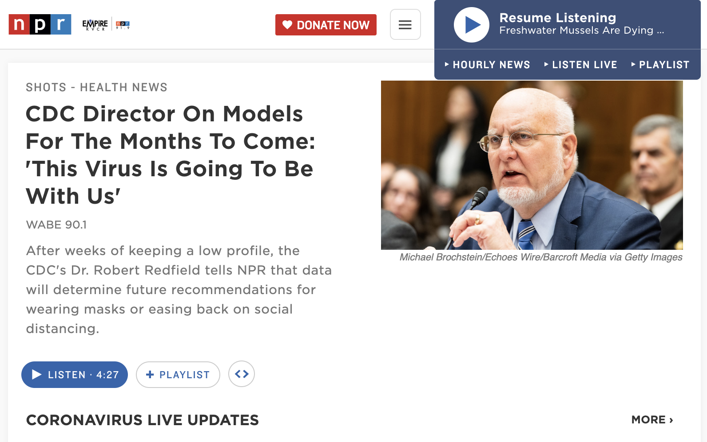

# DH150-2019F-demo
for class demonstration

## it is fun!

### smaller

[goto NPR](http://npr.org)

http://npr.org

<a href="http://npr.org" target="_new"> NPR </a>

https://images.unsplash.com/photo-1585511582346-9aeff1bef830?ixlib=rb-1.2.1&ixid=eyJhcHBfaWQiOjEyMDd9&auto=format&fit=crop&w=1868&q=80

### testing the filename with space by %20

### testing the filename with space " "

make a difference!

<table>
  <tr>
    <td>  </td>
     <td>  </td>
  </tr>
</table>

https://selinapan.github.io//DH150/Images/Jessica%20Chen%20Empathy%20Map.png
